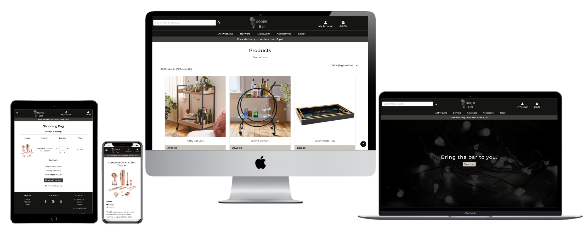
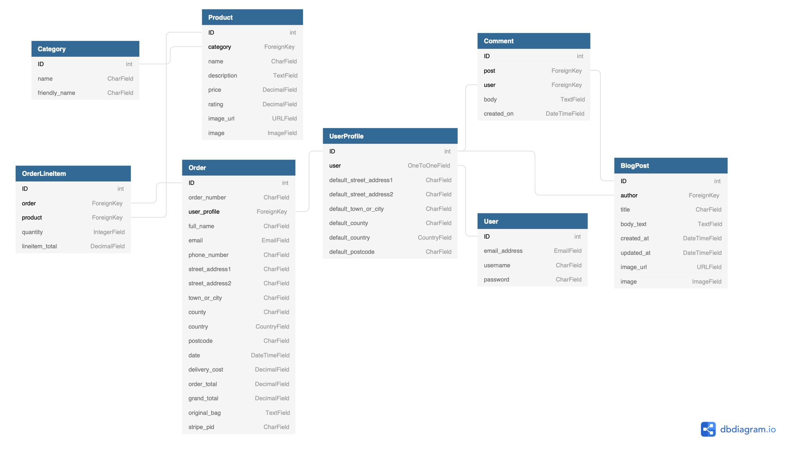

# 
**MS4: Boojie Bar**

 ### View the live project [here.](https://ms4-boojiebar.onrender.com/)

This website has been created as my submission for Milestone Project 4 for the Code Institute. *Boojie Bar* is an e-commerce website specialising in the sale of cocktail equipment and home-bar decor. The website is designed to be responsive and accessible on a variety of devices, allowing potential customers to easily browse and/or purchase the available products. 

**Please note** that this site has been created solely for educational purposes so **Please** do not attempt to enter real card details when using the stripe functionality. The below card details are for testing purposes:
- Card number: 4242 4242 4242 4242
- Date: future date
- CVV/ZIP: any integers

Admin login details for the assessor have been included as a comment when submitting the project.

---

## Contents
- [**User Experience (UX)**](#ux)
    - [Strategy](#strategy)
        - [Target Audience](#target-audience)
        - [User Stories](#user-stories)
    - [Scope](#scope)
    - [Structure](#structure)
    - [Skeleton](#skeleton)
    - [Surface](#surface)
        - [Design](#design)
        - [Colour](#colour)
        - [Fonts and Icons](#fonts-and-icons)
 - [**Features**](#features)
    - [Features Left to Implement](#features-left-to-implement)
 - [**Technologies Used**](#technologies-used)
    - [Languages](#languages)
    - [Technologies](#technologies)
 - [**Testing**](#testing)
 - [**Deployment**](#deployment)
    - [Creating the Project](#creating-the-project)
    - [Deploying to Heroku](#deploying-to-heroku)
    - [Deploying Locally](#deploying-locally)
 - [**Credits**](#credits)
    - [Content](#content)
    - [Code](#code)
    - [Acknowledgements](#acknowledgements)

---
## 
**UX**

### **Strategy**
*Boojie Bar* is an e-commerce site that sells cocktail equipment and accessories. It offers customers a great selection of high-quality products, perfect for setting up their ideal home-bar.

#### Target Audience
The target audience for this website would be adults looking to start or add to their collection of cocktail equipment and accessories. 

#### User Stories
All Users:
- As a customer; I want the site to be responsive and easy to navigate.
- As a customer; I want to view all products available on the site.
- As a customer; I want to view individual details of each product.
- As a customer; I want to view all products in a specific category.
- As a customer; I want to easily add my chosen products to my shopping bag.
- As a customer; I want to easily view the total of my shopping bag.
- As a customer; I want to adjust the quantity of each product in my shopping bag or delete it entirely.
- As a customer; I want to sort products by price, name, ratings etc.
- As a customer; I want to search for a specific product.
- As a customer; I want to easily complete my purchase in the checkout.
- As a customer, I want visual confirmation of any task performed.
- As a customer; I want to receive confirmation of my order.
- As a customer; I want to easily register for an account.

Registered Users:
- As a registered customer; I want to easily log in and out of my account.
- As a registered customer; I want to easily recover access to my account if I forget my password.
- As a registered customer; I want my checkout details saved after making a purchase.
- As a registered customer; I want to view my profile.
- As a registered customer; I want to view my previous orders.
- As a registered customer; I want to edit my details on my profile.
- As a registered customer; I want to post comments on blog posts.

Admin User:
- As an admin; I want to be the only one who is able to add, edit and delete products.

### **Scope**
For All Users:
- The site must be responsive, consistent and easy to navigate.
- An *All Products* page must be provided to allow users to see all that is available.
- A *Product Details* page must be provided for each product to give the customer more information.
- Products must be divided into categories to improve the shopping experience. 
- Customers must be able to sort products by price, name and ratings.
- Customers must be able to search for a product via a *search bar*.
- Clear and simple means of:
    - adding products to shopping bag,
    - viewing the total cost,
    - adjusting quantities of each item,
    - deleting items from shopping bag,
    - reading blog posts,
    - and completing their purchase must be provided.
- Alerts must be provided after any task performed.
- A *Register* page must be provided for new customers.

For Registered Users:
- Clear and simple means of:
    - logging into their account,
    - saving their checkout details,
    - viewing their profile,
    - editing their details,
    - writing comments on blog posts
    - and logging out of their account must be provided.

For Admin Users:
- A clear means of adding, editing and deleting products must be provided.
- The above tasks must only be accessible to a logged-in admin user.

### **Structure**
The site structure will be well laid-out, allowing customers to browse products with ease. All users will have the same navigation bar and footer across the site.

#### Navigation Bar
- Will remain consistent throughout the site.
- Collapsible on smaller devices to avoid crowding.
- Site logo will act as a link to the landing page.
- Shopping bag icon and link will be present at all times.  
    - This allows users to see the total price of the products they have added.
    - This can be helpful to the user to prevent overspending if they have a budget.
- User icon will be present on larger screens;
    - For Unregistered Users: this will reveal links for *Sign Up* and *Sign In* when clicked.
    - For Logged-In Users: this will reveal links for *My Account* and *Sign Out* when clicked.
    - On smaller screens, these links will appear in the collapsed menu to avoid crowding.
- Will contain links to the various product categories, *All Products, Barware, Glassware, Accessories, Decor*.
- Will contain a  *search bar*, allowing users to search a product or a particular word from the database.

#### Footer
- Will remain consistent throughout the site.
- Will be divided into three sections;
    - links for *Home, About Us* and *Shop*.
    - social media icons which will act as links to various social media platforms ( Facebook, Pinterest and Instagram).
        - These links will bring the user to the main social media platform rather than to a particular account.
    - contact information for the company/site owners.

#### Landing Page
- This page will be the same for all users. 
- A hero image introduces the user to the brand of the company, setting the tone for the type of products you can expect to see.
- Users will also be provided with a brief introduction to the company. 
- A link directing users to *Start Shopping* will be provided.

#### All Products
- All products on the site can be accessed via *All Products* or further divided into categories; *Barware, Glassware, Accessories, Decor*.
- Each product is displayed within its own card panel, displaying the image, name, price and rating of the product.
    - When the image or product name are clicked, the user is brought to the *Product Details* page of that particular item.
- All products are contained within one scrolling page, rather than using pagination.
    - This is made user-friendly by providing a *Back to Top* button which, when clicked, will immediately return the user to the top of the page to reduce the need for constant scrolling.

#### Product Details
- Each item, when clicked on, will open into its own page with further product details.
- On this page the user will find an enlarged image of the product with the full product name, price, rating and description.
    - Reviews for that product may also be found here, provided any have been submitted for that particular item.
        - Reviews can only be seen and read by registered user.
        - This can act as an incentive for users to create an account if they have not already done so.
- A quantity selector will be provided to allow the user to choose the amount of that product that they want to purchase.
- Two buttons will be provided, one for *Continue Shopping* and the other for *Add to Bag*.
    - *Continue Shopping* will direct the user back to the *All Products* page in order to browse for more items.
    - *Add to Bag* will add the product into the user's shopping bag.
- Breadcrumb navigation will be provided to allow the user to return to the particular product category or the *All Products*.

#### Shopping Bag
- Will be divided into two sections, *Item(s) in Bag* and *Summary*.
- *Item(s) in Bag* will contain the number of items in the user's bag (e.g. 3 Item(s) in Bag), followed by each product's image, name, quantity and price.
    - The user will be able to increase or decrease the quantity of each product or remove it entirely.
- *Summary* will contain the products total, delivery fee and the grand total. 
- Two buttons will be provided, one for *Continue Shopping* and the other for *Checkout*.
    - *Continue Shopping* will direct the user back to the *All Products* page in order to browse for more items.
    - *Checkout* will bring the user to the expected checkout to complete their purchase.

#### Checkout
- Will provide a form for a user to fill in, with fields for their *Full Name, Email Address, Phone Number, Address 1, Address 2, Town/City, Postal Code, County* and a dropdown menu for *Country*.
    - Registered users, with previously saved information, will see their form fields pre-filled for them.
        - If a registered user is not currently signed in, they will be provided with a link to *Sign In* to retrieve their saved information.
        - Unregistered users may click on a provided link for *Create an account* in order to save this information for future purchases.
- A payment method field is also provided for the user to enter their card details.
    - The payment is processed using **Stripe** with the user being required to enter their card's number, month/year expiry and CVV/CVC number.
- Two buttons are provided;
    - The first for *Checkout* which will complete the purchase.
        - Upon successful payment, the user will be directed to a *Thank You For Your Purchase* page which will display all of the order and delivery details.
    - The second for *Return to Shopping Bag* which will direct the user back if they wish to make any changes.
- Unregistered users may still complete a purchase without having or creating an account. 
    
#### Sign Up
- Will provide a form for an unregistered user to fill in, with fields for *Email Address, Confirm Email Address, Username, Password, Confirm Password* and a *Sign Up* button to submit.
    - A confirmation email will be sent to the provided email address which the user will need to confirm in order to complete the registration.
    - Once the email is confirmed, an account will be created for the user.
- Will also provide a link to the *Sign In* page for users who already have an account ("Have an Account? Sign In Here!").

#### Sign In
- Will provide a form for a registered user to fill in, with fields for their *Email/Username*, their *Password* and a *Sign In* button to submit.
- Will also provide a link to the *Sign Up* page for users who do not have an account ("Not registered yet? Sign Up Here!").

#### My Account
- Will only be available to registered users.
- Will contain their default delivery information; provided they have already completed a purchase in the checkout.
    - This information can be edited by the user.
- Will contain the user's order history, if they have any;
    - This will display the order number, order date, the items ordered and the grand total of the order.
    - The user can click on the order number which acts as a link, bringing the user to the full order details.
- Will contain any reviews that that user has written for products that they have purchased. 

#### Add Product
- Only available to an Admin User.
- Will provide a form for the Admin to fill in to add a new product, with fields for *Category* (dropdown-menu) *Sku, Name, Description, Price, Rating, Image URL* and *Select Image* (file selector).
- Two buttons are provided;
    - The first for *Cancel* which will cancel the addition of the new product.
    - The second for *Add Product* which will successfully create this new product into the database and display it onto the website. 
 
#### Edit Product
- Only available to an Admin User.
- Will provide a form for the Admin to fill in to edit the product;
    - This form will be pre-filled with the product's current values, with fields for *Category* (dropdown-menu) *Sku, Name, Description, Price, Rating, Image URL* and *Select Image* (file selector).
    - The admin user can edit any or all of these fields.
- Two buttons are provided;
    - The first for *Cancel* which will cancel the edit of the product.
    - The second for *Edit Product* which will successfully edit the product in the database and display the new information on the website. 

### **Skeleton**
All wireframes were created using [Balsamiq](https://balsamiq.com/).

#### Mobile

#### Tablet

#### Desktop

All project wireframes can be found below;
- [Mobile Wireframes](documentation/wireframes/mobile)
- [Tablet Wireframes](documentation/wireframes/tablet)
- [Desktop Wireframes](documentation/wireframes/desktop)

### **Surface**
#### Design
The site needs to be visually appealing and consistent in order to keep the user engaged and comfortable. A clean, professional and modern design must be maintained to ensure that focus is not drawn away from its main objective; selling products. 

The purpose of all features and elements must be clear to the user. Any design flaws or hindrances will only serve to frustrate the user, making it unlikely that they will remain on the site to complete a purchase.

#### Colour
I chose a very clean, black and white monochromatic colour scheme for the site. I opted for this modern and sleek look to help keep focus on the products that are being sold. The main hero image will bring a small splash of colour into the monochrome. This same kind of green hue will be used throughout the site in small doses to again provide small pops of colour. 

The simple scheme ensures the user will not experience visual overload. It also helps to create a professional feel which is important for the user to feel like they are purchasing from a reliable source.

I used [Coolors](https://coolors.co/) to help in choosing the colour scheme. I also used it to ensure the chosen colours contrasted well together so that all content could be seen and read clearly by users.

- FFFCF2 Floral White
- CCC5B9 Pale Silver
- 403D39 Black Olive
- 151513 Eerie Black
- 6BDB6B Malachite

#### Fonts and Icons
The Montserrat and Raleway fonts will be used for the site as they work really well together in creating that sleek and modern look that we're looking for.

Font Awesome will provide all icons contained on the site. Icons will help users to easily recognise different elements on the site, for example, the social media links and the shopping bag.

#### Final Changes
Design-wise I didn't venture too far from my initial plans for the website. There were some minor layout adjustments, styling changes etc but for the most part I tried to stick to what I had planned. 

I did venture from my colour scheme at times in favour of Bootstrap colours for some text as wherever they were implemented were for highlighting important information and I didn't want my monochrome theme to hide that importance.

The main thing that I changed was the inclusion of a Blog app and the exclusion of a Review one. Initially I had thought that reviews were the way to go but as I developed the site I felt that both the products being sold, and the consumer they're being sold to, wouldn't benefit that much from reviews. I decided therefore to create a Blog app instead. Blog posts seemed like a more appropriate addition as users are on the site looking to create/upgrade their own bar so having the addition of posts, that discuss that kind of thing, seemed like the best thing to do.

---
## 
**Features**

All site features have been implemented in order to make the user's experience as comfortable and enjoyable as possible. It's extremely important that no features are problematic or complicated as this would likely result in users leaving the site quickly. The site is visually consistent and responsive.

### **Navigation Bar**
- Exists on all site pages on every device allowing users to comfortably navigate through and ensures that they do not end up somewhere they cannot return from.

#### *Main Navigation*
- Contains the site's logo which acts as a link to the *Home* page.
- Contains a search bar for users to conveniently search for products from anywhere on the site.
    - On smaller devices, this appears within a hamburger-style menu to keep the screen clear and uncluttered.
- Contains a dropdown *My Account* menu;
    - For unregistered users/users not currently signed in, this reveals links for *Sign Up* and *Sing In*.
    - For registered users who are currently signed in, this reveals links for *My Account* and *Sign Out*.
    - For admin users, this reveals links for *Manage Products*, *Manage Blogs*,  *My Account* and *Sign Out*.
- Contains a *Shopping Bag* link in the form of a bag icon;
    - When clicked this link will bring the user to their shopping bag.
    - The user's shopping bag grand total, if any, will appear beneath the bag icon throughout the site.

#### *Product Navigation*
- Contains five dropdown menus for the different Product Categories: *All Products, Barware, Glassware, Accessories, Décor*.
    - *Barware* reveals links for Shakers, Tools, Bar Sets and All Barware.
    - *Glassware* reveals links for Cocktails, Novelty, Serving and All Glassware.
    - *Accessories* reveals links for Extras, Books, All Accessories.
    - *Décor* reveals links for Lighting, Decorations, All Décor.
    - *All Products* reveals links for product sorting by price, rating and name.
- On smaller devices, this collapses into a hamburger-style menu to keep the screen clear and uncluttered.

### **Footer**
- Exists on all site pages on every device for consistency.

#### *Explore*
- Contains links to different areas of the site, *Home, Blog* and *Shop*.

#### *Connect*
- Contains three social media links for Facebook, Pinterest and Instagram in the form of the appropriate icons.
    - These icons change colour when hovered over to confirm that they are links.
    - All three links open in a new tab so that the user does not lose their way back to the site.
    - All three links will only bring the user to the general social media platform rather than to a specific profile.

#### *Contact*
- Contains the company's address and phone number.

### **Search Bar**
- Exists in the navigation bar consistently thoughout the site so that the user never has to figure out how or where to search from.
- Allows users to enter in their search query and displays the results, if any.
- Searches for the entered query within the products name and description.
- Brings the user to the main products page to display the results.
    - If no products found: "0 Product(s) found for "< search query >".
    - If products found: "< # of results > Product(s) found for "< search query >" and the resulting products will be displayed.

### **Delivery Banner**
- Exists on all site pages on every device for consistency.
- Can entice users to hit the delivery threshold to take advantage of free delivery.

### **Sign Up Page**
- Only accessible to users not currently logged in.
- A link to the *Sign In* page is provided if the user already has an account ("Already have an account? Then please sign in.")
- A form is provided with fields for Email, Email Confirmation, Username, Password, Password Confirmation and a Sign Up button.
- Placeholder text informs the user what is required in each field.
- Users are alerted, and the form will not be submitted, if any field is empty or filled out incorrectly.
- Users are alerted, and the form will not be submitted, if "A user with that username already exists" and/or "A user is already registered with this e-mail address"
- Upon clicking the Sign Up button (provided fields are successfully filled out), the user will be brought to the *Verify Your E-mail Address* page.

#### *Verify Your Email Address*
- A newly registered user will be directed to this page following submission of the Sign Up form.
- "We have sent an e-mail to you for verification" tells the user what they should expect.
- A toast message contains the email address provided by the user, "Confirmation e-mail sent to < user email >".
- The user receives an email "You're receiving this e-mail because user < entered username > has given yours as an e-mail address to connect their account" with a link to the *Confirm Your E-mail* page.

#### *Confirm Your E-mail*
- The user is directed here after clicking on the provided link in the confirmation email.
- "Please confirm that < user email > is an e-mail address for user < entered username >".
- A Confirm button is provided which when clicked, brings the newly registered user to the *Sign In* page.
- A toast message confirms the action, "You have confirmed < user email >".

### **Sign In Page**
- Only accessible to users not currently logged in.
- A link to the *Sign Up* page is provided if the user does not have an account ("If you have not created an account yet, then please sign up first.")
- A link for *Forgot Password?* is provided if the user is having trouble remembering their password.
- A form is provided with fields for Username or e-mail and Password and a Sign In button.
- Placeholder text informs the user what is required in each field.
- Users are alerted, and the form will not be submitted, if any field is empty or filled out incorrectly.
- Upon clicking the Sign In button (provided both fields are successfully filled out), the user will be brought to the *Home* page.
- A toast message confirms the action, "Successfully signed in as < username >".

#### *Forgot Password?*
- When clicked this link brings the user to the *Password Reset* page.
- A form is provided with a field for E-mail address and a Reset My Password button.
- Users are alerted, and the form will not be submitted, if any field is empty or filled out incorrectly.
- Upon clicking the Reset My Password button, an email will be sent to the user containing a link to reset their password which brings the user to the *Change Password* page.

#### *Change Password*
- A form is provided with fields for New Password and New Password (again) and a Change Password button.
- Users are alerted, and the form will not be submitted, if any field is empty or filled out incorrectly.
- Upon clicking the Change Password button, the user will be alerted to their successful password change in the form of a toast "Password successfully changed!"
- The user can now sign in with their new password.

### **Sign Out Page**
- The user is asked if they are sure they want to sign out and are provided with a Sign Out button.
- When clicked this button will successfully sign them out of their account.

### **Landing Page**
- Consists of a hero image and heading, designed to be clear and simple while helping to set the overall tone of the site.
- A Shop Now button is provided beneath the heading giving users access to the store straight away.
- This button brings the user directly to the All Products page.

### **All Products**
- All store products appear on this page in the form of equal-sized card panels.
- Each panel displays the products name, image, price, category and rating.
- Each panel's product name and image are links which, when clicked, will bring the user to that product's own page.
- Each panel's product category is a link which, when clicked, will bring the user to that product's category page.
- The total number of products contained on the page is displayed (e.g. "99 Product(s)").
- A back-to-top button is provided to create a more pleasant experience, preventing the user from having to scroll all the way back to the top.
    - I opted against pagination as I felt the store was not yet on a large enough scale to justify it as I didn't want users to become annoyed having to go onto the next page every ten items or so.

#### *Sorting Products*
- A select box for sorting products is provided with the user being able to sort products by:
    - Price (low to high)
    - Price (high to low)
    - Rating (low to high)
    - Rating (high to low)
    - Name (A-Z)
    - Name (Z-A)
- Once the user has selected one of the above options, a link appears to reset the selection back to just all products, "All Products".
- The selection can also be reset by selecting the first option "Sort by...".
- The user can also sort products by price, rating and name using the links in the [Product Navigation](#product-navigation).

#### *Categories*
- The user can shop by product category using the links in the [Product Navigation](#product-navigation) and via the links within each product card panel.
- When selecting *All Glassware* for example, the products displayed are only those within that category with further links for *Cocktails, Novelty* and *Serving* to narrow it down more specifically.

### **Product Details Page**
- Each product has its own product_details page displaying:
    - Product Name (product .name)
    - Product Image (product.image)
    - Product Price (product.price)
    - Product Category (product.category)
    - Product Rating (product.rating)
- A quantity selector is provided allowing users to choose the quantity of item they want.
    - They can enter a value (between 1 and 99) or use the plus and minus icons to adjust the value accordingly.
- A Continue Shopping button is provided allowing the user to return to the Products Page.
- An Add to Bag button is provided which, when clicked, adds the chosen product and quantity into the user's shopping bag.
- A toast confirms this addition, displaying the name of the product added and the items currently in the shopping bag.

### **Toasts**
- Toasts (success, info, warning, danger) are used throughout the site to provide visual feedback for users on any actions performed or errors encountered.
- They are displayed in the top right of the page just beneath the shopping bag icon.

#### *Shopping Bag Toast*
- When users add products to their bag, change the quantity of an item in it, or delete an item from it, a view of their bag appears within the success toast.
- This toast displays a message stating what action has just occured (e.g. "Added Crystal Martini Glasses - set of 2) to your bag!").
- It displays the items currently in the shopping bag, providing the product's image, name, quantity, total and a View Shopping Bag button.
- If the user has not yet spent enough for free delivery, a banner will appear above the button displaying how much more they need to spend in order to activate free delivery.
- The button when clicked will bring the user directly to the *Shopping Bag* page.

### **Shopping Bag Page**
- Users can access their shopping bag via the link in [Main Navigation](#main-navigation) or via the button within the success toast when it appears.
- If nothing is in the bag, users will be provided with a Continue Shopping link to return them to the Products page.
- If there are items in the bag, it displays the number of items and:
    - Each product is listed with its image, name, quantity and price.
        - product name is hidden on small devices for a clearer view.
    - A quantity selector is provided allowing users to adjust the quantity of item they want.
    - Two icons, one for Update and one for Delete, are provided beneath the selector.
        - Update will adjust the quantity that the user may have changed within the selector and ensure it actually updates in the bag.
- A summary of the bag is also provided, displaying Product Total, Delivery Fee and Grand Total.
    - If the user has not yet spent enough for free delivery, a message will appear beneath the total displaying how much more they need to spend in order to activate free delivery.
- A Continue Shopping button is provided allowing the user to return to the Products Page.
- A Secure Checkout button is provided which, when clicked, brings the user to the *Checkout* page.

### **Checkout Page**
- Will provide a form for a user to fill in, with fields for their Full Name*, Email Address*, Phone Number*, Address 1*, Address 2, Town/City*, Postal Code, County and a dropdown menu for Country*.
    - Registered users, with previously saved delivery information, will see the form pre-filled with that saved data.
        - A checkbox is also provided which, if ticked, will save the information within the form to the user's profile.
    - Unregistered users/users not currently signed-in may click on a provided link for "*Create an account* or *Sign In* to save this information" in order to save it for future purchases.
- An order summary is provided with the products the user is ging to purchase, displaying the product images, names, quantities and subtotals.
    - Product Total, Delivery Fee and Grand Total are also displayed;
        - If the user has not yet spent enough for free delivery, a message will appear beneath the total displaying how much more they need to spend in order to activate free delivery.
- An Adjust Bag is provided at the bottom of the page, allowing users to return to their shopping bag to make any adjustments before checking out.
- Unregistered users may still complete a purchase without having or creating an account.

#### *Stripe Payment*
- A payment form is provided from **Stripe** which allows users to enter in a Card Number, MM/YY, CVC and ZIP.
- The form is validated with Stripe and will display any errors that may occur, e.g. invalid card number, expiry date etc.
- A Complete Order button is provided which, when clicked will take the user to a *Thank You* page and will trigger an order confirmation email to be sent to the user's entered email address.
- A message below the Complete Order button displays how much the user's card is going to be charged.

#### *Thank You Page*
- The user is brought to this order confirmation page following a successful checkout.
- The user is informed that a confirmation email will be sent to their email address.
- A toast confirms the successful order, displaying the order number and email address.
- The page is split into four sections, Order Info, Order Details, Delivering To and Billing Info.
    - Order Info: displays the order number and the time and date it was placed.
    - Order Details: displays a list of the products purchased with each product's image, name, quantity and price/unit.
    - Delivering To: displays the entered delivery information.
    - Billing Info: displays the Order Total, Delivery and Grand Total.
- A Back to Store button is provided, allowing the user to do some more shoppinng or browsing.

### **Profile Page**
- Registered users can find their delivery information (if they chose to save it) now pre-filled within the form on their profile page.
- The form provided has fields for Phone Number, Street Address 1, Street Address 2, County, Country, Postcode and an Update button.
    - The user can change their delivery details here.
- The Update button, when clicked, will fill the form with the newly entered details and will save it to the database.
    - If the user makes another purchase, they'll see the updated information pre-filled in the checkout form.

#### *Order History*
- The user's order history is also displayed on their profile, displaying order number, date, product names and total.
    - names are hidden on small devices for a clearer view.
    - the order number acts as a link which, when clicked, brings the user back to the *Thank You* page of the order confirmation.
        - A toast informs the user that this is a past order confirmation.
        - A Back to Profile is provided, taking the user back to their account page.

### **Blog Posts**
- Users can navigate to the Blogs page using the link in the footer.
- All blog posts appear on this page in the form of equal-sized card panels.
- Each panel displays an image, the title of the blog, who it was written by, the date it was created, a snippet of the blog content and a Read More Button.
    - The image, title and Read More button are all links that will bring the user to that blog's own page.
- A back-to-top button is provided to create a more pleasant experience, preventing the user from having to scroll all the way back to the top.

### **Blog Details Page**
- Each blog has its own blog_details page displaying:
    - blog.title
    - blog.author
    - blog.created_at
    - blog.updated_at
    - blog.image
    - blog.body_text
    - Comment Section

- An All Blog Posts button is provided allowing the user to return to the Blogs Page.

#### *Blog Comments*
- A Comments section for the blog is provided at the bottom of the page.
- It displays how many comments are currently there, or if there are none, a message appears inviting users to post a comment.
- Only registered users can read and add comments.
    - This acts as another method of enticing users to create an account.
    - Unregistered users will see the following: "Sign In or Register to see or add comments on this post!"
- Each comment displays:
    - comment.user
    - comment.create_on
    - comment.body
- Admin users can see links for Edit and Delete comments above the comment.body.
    - **At the point of project submission, these buttons are not functional and so are left as a feature to be implemented.**
- A form to add a comment is provided with fields for User, Body and an Add Comment button.
- The Add Comment button, when clicked, successfully adds the user's comment to the blog post.
    - The new comment can now be seen.

### **Manage Products**
- Only available to admin users of the site.
- Allows admin to add products, edit and delete them.

#### *Add Product*
- Accessible to admin via the *Manage Products* link.
- Will provide a form for the admin to fill in to add a new product, with fields for Category (dropdown-menu), Name, Description, Price, Rating, Image URL, Select Image (file selector) and an Add Product button.
    - A Cancel button is provided and, when clicked, will return the admin to the Products page.
    - Products may be uploaded without an image with a default image taking its place.
- The Add Product button, when clicked, will successfully add the new product to the site and will bring the admin to the new product's page.
- The new product can now be found and searched for within the site.

#### *Edit Product*
- Accessible to admin via the *Edit* links contained on both the product card panels and each individual product page.
- Will provide a form for the admin to fill in to edit the product, with the fields for Category (dropdown-menu), Name, Description, Price, Rating, Image URL, Select Image (file selector) pre-filled with the product's current values.
    - A Cancel button is provided and, when clicked, will return the admin to the Products page.
    - Products may be uploaded without an image with a default image taking its place.
- The Update Product button, when clicked, will successfully update the product on the site and will bring the admin to the updated product's page.
- The updated product can now be found and searched for within the site.

#### *Delete Product*
- Accessible to admin via the *Delete* links contained on both the product card panels and each individual product page.
- Once this Delete link is clicked, the product will immediately be deleted from the site.
    - This is not ideal to have in place as the admin could easily delete products accidentally so a defensive feature is required.
        - **At the point of project submission, this defensive feature has not been added and so is left as a feature to be implemented.**

### **Manage Blogs**
- Only available to admin users of the site.
- Allows admin to add blogs, edit and delete them.

#### *Add Blog*
- Accessible to admin via the *Manage Blogs* link.
- Will provide a form for the admin to fill in to add a new blog, with fields for Author, Title, Body text, Image URL, Select Image (file selector) and an Add Blog button.
    - A Cancel button is provided and, when clicked, will return the admin to the Blogs page.
    - Blogs may be uploaded without an image with a default image taking its place.
- The Add Blog button, when clicked, will successfully add the new blog to the site and will bring the admin to the new blog's page.
- The new blog can now be found and searched for within the site.

#### *Edit Blog*
- Accessible to admin via the *Edit* links contained on both the blog card panels and each individual blog page.
- Will provide a form for the admin to fill in to edit the product, with fields for Author, Title, Body text, Image URL, Select Image (file selector) pre-filled with the product's current values.
    - A Cancel button is provided and, when clicked, will return the admin to the Blogs page.
    - Blogs may be uploaded without an image with a default image taking its place.
- The Update Blog button, when clicked, will successfully update the blog post on the site and will bring the admin to the updated blog's page.
- The updated blog post can now be found on the site.

#### *Delete Blog*
- Accessible to admin via the *Delete* links contained on both the blog card panels and each individual blog page.
- Once this Delete link is clicked, the blog post will immediately be deleted from the site.
    - This is not ideal to have in place as the admin could easily delete them accidentally so a defensive feature is required.
        - **At the point of project submission, this defensive feature has not been added and so is left as a feature to be implemented.**.

### **Features Left to Implement**
#### *Defensive Features*
- For a future release, there needs to be some defense in place for the deletion of blogs and products to prevent admin users from deleting them accidentally.
- This may be done in the form of a delete modal that is triggered upon clicking Delete and will ensure the admin user has to select confirm to delete.

#### *Edit and Delete Blog Comments*
- For a future release, the buttons/links for Edit and Delete of blog comments need to be functional.
- The deletion aspect will also need some defense as mentioned above.

#### *Social Aspects*
- The ability for registered users to engage with one another, e.g. directly responding to someone's blog comments.
- Potentially giving registered users the option to upload their own blog posts, with admin still having the option to delete if not appropriate.
- Potenially incorporate some kind of recipe database where users can browse cocktail/drink recipes and registered users can add to the database.

---
## 
**Technologies Used**

### **Languages**
- HTML
- CSS
- JavaScript/jQuery
- Python (with the following);
    - asgiref==3.4.1
    - boto3==1.18.31
    - botocore==1.21.31
    - dj-database-url==0.5.0
    - Django==3.2.6
    - django-allauth==0.41.0
    - django-countries==7.2.1
    - django-crispy-forms==1.12.0
    - django-storages==1.11.1
    - gunicorn==20.1.0
    - jmespath==0.10.0
    - oauthlib==3.1.1
    - Pillow==8.3.1
    - psycopg2-binary==2.9.1
    - python3-openid==3.2.0
    - pytz==2021.1
    - requests-oauthlib==1.3.0
    - s3transfer==0.5.0
    - sqlparse==0.4.1
    - stripe==2.60.0

### **Technologies**
- [Adobe Photoshop](https://www.adobe.com/ie/products/illustrator.html) - used to resize product images.
- [Amazon Web Services](https://aws.amazon.com/) - used to store static files and images.
- [Balsamiq](https://balsamiq.com/) - used to create wireframes.
- [Bootstrap](https://getbootstrap.com/) - used throughout the site for responsive layouts and styling.
- [Canva](https://www.canva.com/) - used to create the site logo.
- [Coolors](https://coolors.co/) - used for choosing colour scheme.
- [ dbdiagram](https://dbdiagram.io/home) - used to create database schema diagram.
- [Django](https://www.djangoproject.com/) - Python web framework used throughout this project.
- [Favicon](https://favicon.io/)- used to create site favicons.
- [Font Awesome](https://fontawesome.com/) - used for all icons seen on the site.
- [Git](https://git-scm.com/) - version control software used to commit and push code to GitHub.
- [GitHub](https://github.com/) - hosting site used to store the source code of the site.
- [GitPod](https://www.gitpod.io/) - IDE used to develop the site.
- [Google Chrome DevTools](https://developers.google.com/web/tools/chrome-devtools) - used for inspecting various page elements and identifying any layout issues/bugs. 
- [Google Fonts](https://fonts.google.com/specimen/Montserrat) - used to import Montserrat and Raleway fonts.
- [Heroku](https://www.heroku.com/) - used to deploy live website.
- [Jinja](https://jinja.palletsprojects.com/en/2.11.x/) - used for templating language.
- [Stripe](https://stripe.com/en-ie) - used for payment processing in checkout app.
- [TingPNG](https://tinypng.com/) - used to resize some images for web.

---

## 
**Database**

This project used Django's default databse, SQLite during development and then changed to PostgreSQL for deployment.
The following models were created:

### **Data Models**
**Product App**

Category Model

    class Category(models.Model):
        class Meta:
            verbose_name_plural = 'Categories'

        name = models.CharField(max_length=254)
        friendly_name = models.CharField(max_length=254, null=True, blank=True)

Product Model

    class Product(models.Model):
        category = models.ForeignKey(
            'Category', null=True, blank=True, on_delete=models.SET_NULL)
        name = models.CharField(max_length=254)
        description = models.TextField()
        price = models.DecimalField(max_digits=6, decimal_places=2)
        rating = models.DecimalField(
            max_digits=6, decimal_places=2, null=True, blank=True)
        image_url = models.URLField(max_length=1024, null=True, blank=True)
        image = models.ImageField(null=True, blank=True)

**Checkout App**

Order Model

    class Order(models.Model):
        order_number = models.CharField(max_length=32, null=False, editable=False)
        user_profile = models.ForeignKey(
            UserProfile, on_delete=models.SET_NULL, null=True, blank=True,
            related_name='orders')
        full_name = models.CharField(max_length=50, null=False, blank=False)
        email = models.EmailField(max_length=254, null=False, blank=False)
        phone_number = models.CharField(max_length=20, null=False, blank=False)
        street_address1 = models.CharField(max_length=80, null=False, blank=False)
        street_address2 = models.CharField(max_length=80, null=True, blank=True)
        town_or_city = models.CharField(max_length=40, null=False, blank=False)
        county = models.CharField(max_length=80, null=True, blank=True)
        country = CountryField(blank_label='Country *', null=False, blank=False)
        postcode = models.CharField(max_length=20, null=True, blank=True)
        date = models.DateTimeField(auto_now_add=True)
        delivery_cost = models.DecimalField(max_digits=6, decimal_places=2,
                                            null=False, default=0)
        order_total = models.DecimalField(max_digits=10, decimal_places=2,
                                        null=False, default=0)
        grand_total = models.DecimalField(max_digits=10, decimal_places=2,
                                        null=False, default=0)
        original_bag = models.TextField(null=False, blank=False, default='')
        stripe_pid = models.CharField(max_length=254, null=False, blank=False,
                                    default='')

OrderLineItem Model

    class OrderLineItem(models.Model):
        order = models.ForeignKey(Order, null=False, blank=False,
                                on_delete=models.CASCADE,
                                related_name='lineitems')
        product = models.ForeignKey(Product, null=False, blank=False,
                                    on_delete=models.CASCADE)
        quantity = models.IntegerField(null=False, blank=False, default=0)
        lineitem_total = models.DecimalField(max_digits=6, decimal_places=2,
                                             null=False, blank=False,
                                             editable=False)

**Profile App**

UserProfile Model

    class UserProfile(models.Model):
        user = models.OneToOneField(User, on_delete=models.CASCADE)
        default_phone_number = models.CharField(
            max_length=20, null=True, blank=True)
        default_street_address1 = models.CharField(
            max_length=80, null=True, blank=True)
        default_street_address2 = models.CharField(
            max_length=80, null=True, blank=True)
        default_town_or_city = models.CharField(
            max_length=40, null=True, blank=True)
        default_county = models.CharField(
            max_length=80, null=True, blank=True)
        default_country = CountryField(
            blank_label='Country', null=True, blank=True)
        default_postcode = models.CharField(
            max_length=20, null=True, blank=True)

**Blog App**

BlogPost Model

    class BlogPost(models.Model):
        author = models.ForeignKey(
            UserProfile, on_delete=models.CASCADE)
        title = models.CharField(max_length=200)
        body_text = models.TextField(default=None, blank=True, null=True)
        created_at = models.DateTimeField(auto_now_add=True, blank=True)
        updated_at = models.DateTimeField(auto_now=True, blank=True)
        image_url = models.URLField(max_length=1024, null=True, blank=True)
        image = models.ImageField(null=True, blank=True)

Comment Model

    class Comment(models.Model):
        post = models.ForeignKey(
            BlogPost, on_delete=models.CASCADE, related_name='comments')
        user = models.ForeignKey(
            UserProfile, on_delete=models.CASCADE)
        body = models.TextField()
        created_on = models.DateTimeField(auto_now_add=True)

        class Meta:
            ordering = ['created_on']

### **Database Schema**

---
## 
**Testing**

Testing information and content for this project can be found in the [separate TESTING.md](TESTING.md) file.

---
## 
**Deployment**

### **Creating the Project**
This project used the Code Institute's student [template](https://github.com/Code-Institute-Org/gitpod-full-template). A new repository named **ms4-boojiebar**
was created which included all branches from the template. The project was developed using the IDE [GitPod](https://www.gitpod.io/). Version control software [Git](https://git-scm.com/) was used to commit and push the code to 
[GitHub](https://github.com/) where it was stored. The following commands were used for this:
- **git add** ***filename/directory*** - This command adds files/directories to the staging area to be committed.
- **git commit -m** *"message here"* - This command commits files/directories to the repository. Commit messages should clearly explain the update being committed.
- **git push** - This command pushes all committed updates/changes into the GitHub repository.

### **Deploying to Heroku**
Heroku needs some files in order to know which apps and dependencies are needed - for this project these can be found [here](#languages).
- requirements.txt (type command **"pip3 freeze --local > requirements.txt"**).
- create **Procfile** (ensuring you enter a capital P).
    - inside type: 'web: gunicorn your-app.wsgi:application'.
- Add, commit and push.

#### **Create Heroku App:**
- Create an account or login to [Heroku](https://www.heroku.com/).
- Click on the *New* button on the top right of your dashboard.
- Select **Create new app**.
- Enter your new unique app name.
- Choose your region.
- Select **Create app**.

#### **Setup Postgres:**
- On your new app's Heroku dashboard, select the *Resources* tab.
- Enter "postgres" into the search box and select **Heroku Postgres**.
- In *settings.py*; 
    - comment out DATABASES
    - import dj_database_url
    - type in: DATABASES 'default': dj_database_url.parse("your-postgres-url")
    - migrate the models (*python3 manage.py migrate*)
    - load data to Postgres (*python3 manage.py loaddata categories* followed by *python3 manage.py loaddata products*)
    - create a superuser (*python3 manage.py createsuperuser*)
    - back in *settings.py*, remove "DATABASES 'default': dj_database_url.parse("your-postgres-url")" and un-comment the previously commented-out DATABASES.
    - Add, commit and push to GitHub.
    
#### **Set Environment Variables:**
- Navigate to your app's *Settings* tab.
- Under *Config Vars*, click **Reveal Config Vars**.
- The following need to be added:
    - AWS_ACCESS_KEY_ID
    - AWS_SECRET_ACCESS_KEY
    - DATABASE_URL
    - EMAIL_HOST_PASS
    - EMAIL_HOST_USER
    - SECRET_KEY
    - STRIPE_PUBLIC_KEY
    - STRIPE_SECRET_KEY
    - STRIPE_WH_SECRET
    - USE_AWS

#### **Connect to GitHub Repository:**
- On your new app's page, navigate to the *Deploy* tab.
- Under *Deployment method*, select **GitHub**.
- Under *Connect to GitHub* (and making sure your GitHub profile is displayed), enter the name of your repository and click **Search**.
- Once your repo has been found, click **Connect**.

#### **Automatic Deployment:**
- Navigate to your app's *Deploy* tab.
- Under *Automatic deploys*, select the branch you wish to deploy from.
- Click **Enable Automatic Deploys**.

#### **Amazon Web Services**
Amazon Web Services ([AWS](https://aws.amazon.com/)) is used to store the static files and images for the app.
- Create an account.
- Open **S3** and create a new bucket.
    - recommend naming bucket the same as Heroku app name.
    - choose region closest to you.
    - uncheck box to block public access; bucket must be public.
- Create S3 Bucket Policy.
- Create a group.
- Create an access policy.
- Create a user.

### **Deploying Locally**
**Please note** that the project will not run locally without several Environmental Variable Keys. For security reasons, these details are not included in this repository.
- DEVELOPMENT=True
- EMAIL_HOST_PASS=YOUR_SECRET_KEY
- EMAIL_HOST_USER=email_address
- SECRET_KEY=YOUR_SECRET_KEY
- STRIPE_PUBLIC_KEY=YOUR_SECRET_KEY
- STRIPE_SECRET_KEY=YOUR_SECRET_KEY
- STRIPE_WH_SECRET=YOUR_SECRET_KEY

In order to make a clone, follow these steps:
- Log into GitHub.
- Navigate to the **Repositories** tab.
- Choose the desired repository.
- Above the list of files, click on the **Code** drop-down menu.
- Copy the clone URL under the **HTTPS** tab.
- Open a terminal window in your IDE of choice.
- Change the working directory to whichever location you want the cloned directory to be in.
- Type *git clone* and then paste the URL that you copied earlier.
- Press enter to create the clone.
- In your IDE of choice, type *pip install -r requirements.txt* in order to install all required packages for project.

---
## 
**Credits**

### **Content**
- All products contained on the site are sourced from [Cocktail Emporium](https://www.cocktailemporium.com/) and [Urban Outfitters](https://www.urbanoutfitters.com/).
    - Links to all used products can be found [here](documentation/product-sources.pdf).

### **Media**
- Site logo created by me using [Canva](https://www.canva.com/).
- Hero image by Getty Images on [Canva](https://www.canva.com/media/MAEObAH7gWw).
- All product images are sourced from [Cocktail Emporium](https://www.cocktailemporium.com/) and [Urban Outfitters](https://www.urbanoutfitters.com/).
    - Links can be found [here](documentation/product-sources.pdf). 
- Default "No-Image-Provided" on Product pages created by me using [Canva](https://www.canva.com/).
- Default "No-Image-Provided" on Blog pages by Getty Images Pro on [Canva](https://www.canva.com/media/MADaFO2gkDo).
- Other images uploaded by me for Blog Posts sourced below:
    - [romandebree](https://www.canva.com/media/MADcAZGE6Ps)
    - [Getty Images](https://www.canva.com/media/MAC3_xMmxXs)
    - [Getty Images Pro](https://www.canva.com/media/MADesIFsOZg)
    - [Getty Images](https://www.canva.com/media/MAC5-TIkGJI)
    - [Getty Images Pro](https://www.canva.com/media/MADauJOsN7c)
    - [Getty Images Pro](https://www.canva.com/media/MADaGJgpnmY)

### **Code**
- I took inspiration from my previous milestone projects in implementing certain aspects of code.
- Code for hero image on landing page taken and adapted from [w3schools.com](https://www.w3schools.com/howto/howto_css_hero_image.asp).
- Code Institute's **Boutique Ado** module was an extremely useful resource and provided the foundation for this project.
- [Stack Overflow](https://stackoverflow.com/) was a helpful resource for working out any minor code issues.
- [Django Central](https://djangocentral.com/creating-comments-system-with-django/), my mentor Spencer Barriball and [Stack Overflow](https://stackoverflow.com/questions/55872523/what-does-integrityerror-not-null-constraint-failed-blog-comment-post-id-st) provided valuable assistance for creating the Blog app models.
 
### **Acknowledgements**
- My mentor, Spencer Barriball for all of his help on this project.
- Friends and family who viewed the site, providing useful feedback and suggestions.
- Michael from Tutor Support who helped me figure out some migration issues after deployment.
- The Slack community for all the information and suggestions already present.
