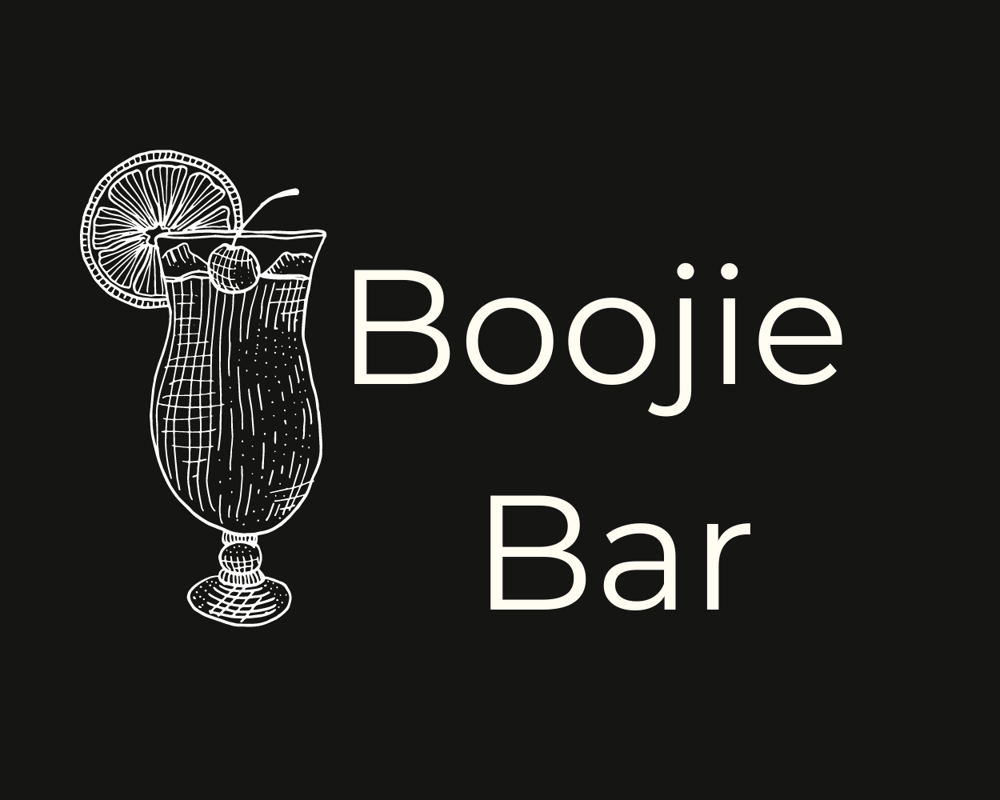
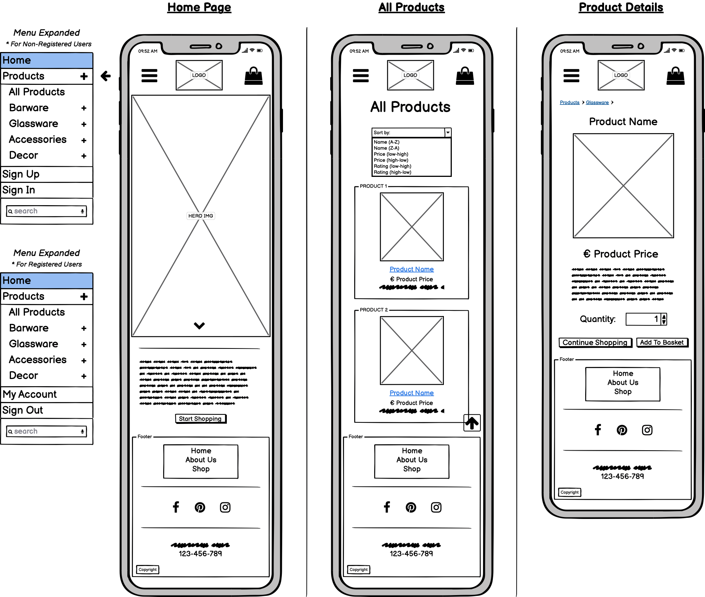
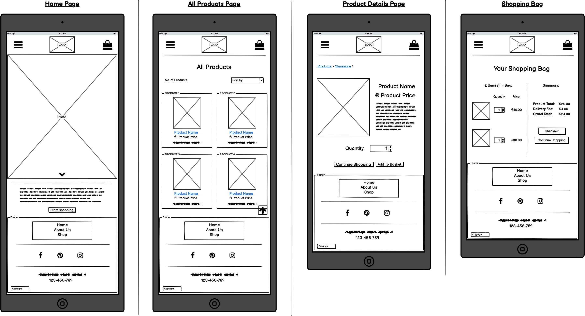
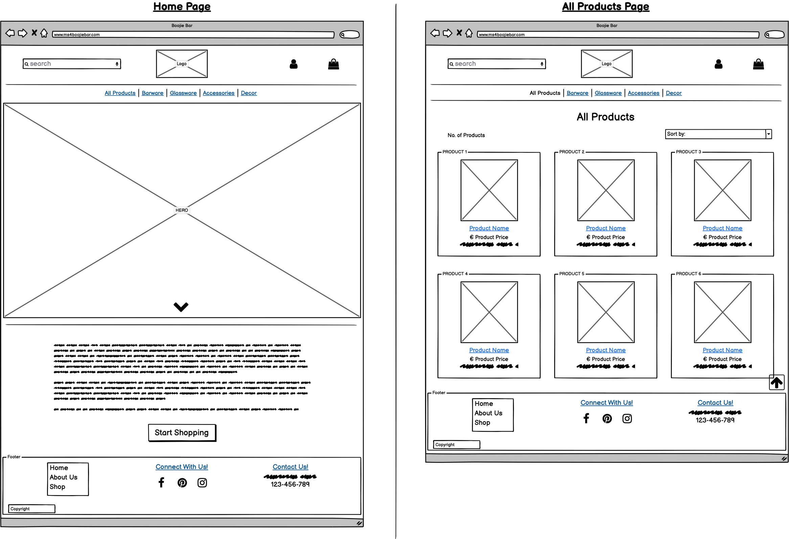
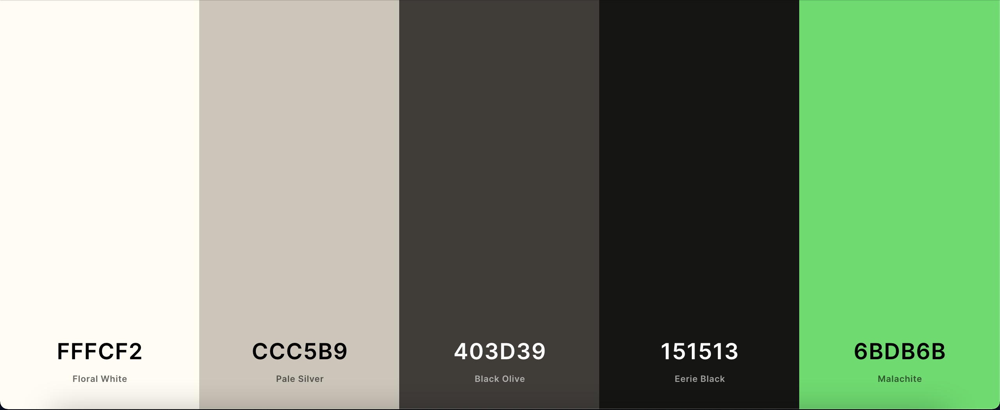

# 
**MS4: Boojie Bar**

 ### View the live project [here.]()

This website has been created as my submission for Milestone Project 4 for the Code Institute. *Boojie Bar* is an e-commerce website specialising in the sale of cocktail equipment and home-bar decor. The website is designed to be responsive and accessible on a variety of devices, allowing potential customers to easily browse and/or purchase the available products. 

---

## Contents
- [**User Experience (UX)**](#ux)
    - [Strategy](#strategy)
        - [Target Audience](#target-audience)
        - [User Stories](#user-stories)
    - [Scope](#scope)
    - [Structure](#structure)
    - [Skeleton](#skeleton)
    - [Surface](#surface)
        - [Design](#design)
        - [Colour](#colour)
        - [Fonts and Icons](#fonts-and-icons)
 - [**Features**](#features)
    - [Features Left to Implement](#features-left-to-implement)
 - [**Technologies Used**](#technologies-used)
    - [Languages](#languages)
    - [Technologies](#technologies)
 - [**Testing**](#testing)
 - [**Deployment**](#deployment)
    - [Creating the Project](#creating-the-project)
 - [**Credits**](#credits)
    - [Content](#content)
    - [Code](#code)
    - [Acknowledgements](#acknowledgements)

---
## 
**UX**

### **Strategy**
*Boojie Bar* is an e-commerce site that sells cocktail equipment and accessories. It offers customers a great selection of high-quality products, perfect for setting up their ideal home-bar.

#### Target Audience
The target audience for this website would be adults looking to start or add to their collection of cocktail equipment and accessories. 

#### User Stories
All Users:
- As a customer; I want the site to be responsive and easy to navigate.
- As a customer; I want to easily contact the site owners with any questions/issues I might have.
- As a customer; I want to view all products available on the site.
- As a customer; I want to view individual details of each product.
- As a customer; I want to view all products in a specific category.
- As a customer; I want to easily add my chosen products to my shopping bag.
- As a customer; I want to easily view the total of my shopping bag.
- As a customer; I want to adjust the quantity of each product in my shopping bag or delete it entirely.
- As a customer; I want to sort products by price, name, ratings etc.
- As a customer; I want to search for a specific product.
- As a customer; I want to easily complete my purchase in the checkout.
- As a customer, I want visual confirmation of any task performed.
- As a customer; I want to easily register for an account.

Registered Users:
- As a registered customer; I want to easily log in and out of my account.
- As a registered customer; I want my checkout details saved after making a purchase.
- As a registered customer; I want to view my profile.
- As a registered customer; I want to edit my details on my profile.
- As a registered customer; I want to be able to delete my profile.
- As a registered customer; I want to read product reviews left by other customers.
- As a registered customer; I want to write reviews on items I have purchased.

Admin User:
- As an admin; I want to be the only one who is able to add, edit and delete products.

### **Scope**
For All Users:
- The site must be responsive, consistent and easy to navigate.
- An *All Products* page must be provided to allow users to see all that is available.
- A *Product Details* page must be provided for each product to give the customer more information.
- Products must be divided into categories to improve the shopping experience. 
- Customers must be able to sort products by price, name and ratings.
- Customers must be able to search for a product via a *search bar*.
- Clear and simple means of:
    - adding products to shopping bag,
    - viewing the total cost,
    - adjusting quantities of each item,
    - deleting items from shopping bag,
    - and completing their purchase must be provided.
- Alerts must be provided after any task performed.
- A *Register* page must be provided for new customers.

For Registered Users:
- Clear and simple means of:
    - logging into their account,
    - saving their checkout details,
    - viewing their profile,
    -  editing their details,
    - deleting their account,
    - reading product reviews,
    - writing reviews on purchased products
    - and logging out of their account must be provided.

For Admin Users:
- A clear means of adding, editing and deleting products must be provided.
- The above tasks must only be accessible to a logged-in admin user.

### **Structure**
The site structure will be well laid-out, allowing customers to browse products with ease. All users will have the same navigation bar and footer across the site.

#### Navigation Bar
- Will remain consistent throughout the site.
- Collapsible on smaller devices to avoid crowding.
- Site logo will act as a link to the landing page.
- Shopping bag icon and link will be present at all times.  
    - This allows users to see the total price of the products they have added.
    - This can be helpful to the user to prevent overspending if they have a budget.
- User icon will be present on larger screens;
    - For Unregistered Users: this will reveal links for *Sign Up* and *Sign In* when clicked.
    - For Logged-In Users: this will reveal links for *My Account* and *Sign Out* when clicked.
    - On smaller screens, these links will appear in the collapsed menu to avoid crowding.
- Will contain links to the various product categories, *All Products, Barware, Glassware, Accessories, Decor*.
- Will contain a  *search bar*, allowing users to search a product or a particular word from the database.

#### Footer
- Will remain consistent throughout the site.
- Will be divided into three sections;
    - links for *Home, About Us* and *Shop*.
    - social media icons which will act as links to various social media platforms ( Facebook, Pinterest and Instagram).
        - These links will bring the user to the main social media platform rather than to a particular account.
    - contact information for the company/site owners.

#### Landing Page
- This page will be the same for all users. 
- A hero image introduces the user to the brand of the company, setting the tone for the type of products you can expect to see.
- Users will also be provided with a brief introduction to the company. 
- A link directing users to *Start Shopping* will be provided.

#### All Products
- All products on the site can be accessed via *All Products* or further divided into categories; *Barware, Glassware, Accessories, Decor*.
- Each product is displayed within its own card panel, displaying the image, name, price and rating of the product.
    - When the image or product name are clicked, the user is brought to the *Product Details* page of that particular item.
- All products are contained within one scrolling page, rather than using pagination.
    - This is made user-friendly by providing a *Back to Top* button which, when clicked, will immediately return the user to the top of the page to reduce the need for constant scrolling.

#### Product Details
- Each item, when clicked on, will open into its own page with further product details.
- On this page the user will find an enlarged image of the product with the full product name, price, rating and description.
    - Reviews for that product may also be found here, provided any have been submitted for that particular item.
        - Reviews can only be seen and read by registered user.
        - This can act as an incentive for users to create an account if they have not already done so.
- A quantity selector will be provided to allow the user to choose the amount of that product that they want to purchase.
- Two buttons will be provided, one for *Continue Shopping* and the other for *Add to Bag*.
    - *Continue Shopping* will direct the user back to the *All Products* page in order to browse for more items.
    - *Add to Bag* will add the product into the user's shopping bag.
- Breadcrumb navigation will be provided to allow the user to return to the particular product category or the *All Products*.

#### Shopping Bag
- Will be divided into two sections, *Item(s) in Bag* and *Summary*.
- *Item(s) in Bag* will contain the number of items in the user's bag (e.g. 3 Item(s) in Bag), followed by each product's image, name, quantity and price.
    - The user will be able to increase or decrease the quantity of each product or remove it entirely.
- *Summary* will contain the products total, delivery fee and the grand total. 
- Two buttons will be provided, one for *Continue Shopping* and the other for *Checkout*.
    - *Continue Shopping* will direct the user back to the *All Products* page in order to browse for more items.
    - *Checkout* will bring the user to the expected checkout to complete their purchase.

#### Checkout
- Will provide a form for a user to fill in, with fields for their *Full Name, Email Address, Phone Number, Address 1, Address 2, Town/City, Postal Code, County* and a dropdown menu for *Country*.
    - Registered users, with previously saved information, will see their form fields pre-filled for them.
        - If a registered user is not currently signed in, they will be provided with a link to *Sign In* to retrieve their saved information.
        - Unregistered users may click on a provided link for *Create an account* in order to save this information for future purchases.
- A payment method field is also provided for the user to enter their card details.
    - The payment is processed using **Stripe** with the user being required to enter their card's number, month/year expiry and CVV/CVC number.
- Two buttons are provided;
    - The first for *Checkout* which will complete the purchase.
        - Upon successful payment, the user will be directed to a *Thank You For Your Purchase* page which will display all of the order and delivery details.
    - The second for *Return to Shopping Bag* which will direct the user back if they wish to make any changes.
- Unregistered users may still complete a purchase without having or creating an account. 
    
#### Sign Up
- Will provide a form for an unregistered user to fill in, with fields for *Email Address, Confirm Email Address, Username, Password, Confirm Password* and a *Sign Up* button to submit.
    - A confirmation email will be sent to the provided email address which the user will need to confirm in order to complete the registration.
    - Once the email is confirmed, an account will be created for the user.
- Will also provide a link to the *Sign In* page for users who already have an account ("Have an Account? Sign In Here!").

#### Sign In
- Will provide a form for a registered user to fill in, with fields for their *Email/Username*, their *Password* and a *Sign In* button to submit.
- Will also provide a link to the *Sign Up* page for users who do not have an account ("Not registered yet? Sign Up Here!").

#### My Account
- Will only be available to registered users.
- Will contain their default delivery information; provided they have already completed a purchase in the checkout.
    - This information can be edited by the user.
- Will contain the user's order history, if they have any;
    - This will display the order number, order date, the items ordered and the grand total of the order.
    - The user can click on the order number which acts as a link, bringing the user to the full order details.
- Will contain any reviews that that user has written for products that they have purchased. 

#### Add Product
- Only available to an Admin User.
- Will provide a form for the Admin to fill in to add a new product, with fields for *Category* (dropdown-menu) *Sku, Name, Description, Price, Rating, Image URL* and *Select Image* (file selector).
- Two buttons are provided;
    - The first for *Cancel* which will cancel the addition of the new product.
    - The second for *Add Product* which will successfully create this new product into the database and display it onto the website. 
 
#### Edit Product
- Only available to an Admin User.
- Will provide a form for the Admin to fill in to edit the product;
    - This form will be pre-filled with the product's current values, with fields for *Category* (dropdown-menu) *Sku, Name, Description, Price, Rating, Image URL* and *Select Image* (file selector).
    - The admin user can edit any or all of these fields.
- Two buttons are provided;
    - The first for *Cancel* which will cancel the edit of the product.
    - The second for *Edit Product* which will successfully edit the product in the database and display the new information on the website. 

### **Skeleton**
All wireframes were created using [Balsamiq](https://balsamiq.com/).

#### Mobile

#### Tablet
/

#### Desktop

All project wireframes can be found below;
- [Mobile Wireframes](documentation/wireframes/mobile)
- [Tablet Wireframes](documentation/wireframes/tablet)
- [Desktop Wireframes](documentation/wireframes/desktop)

### **Surface**
#### Design
The site needs to be visually appealing and consistent in order to keep the user engaged and comfortable. A clean, professional and modern design must be maintained to ensure that focus is not drawn away from its main objective; selling products. 

The purpose of all features and elements must be clear to the user. Any design flaws or hindrances will only serve to frustrate the user, making it unlikely that they will remain on the site to complete a purchase.

#### Colour
I chose a very clean, black and white monochromatic colour scheme for the site. I opted for this modern and sleek look to help keep focus on the products that are being sold. The main hero image will bring a small splash of colour into the monochrome. This same kind of green hue will be used throughout the site in small doses to again provide small pops of colour. 

The simple scheme ensures the user will not experience visual overload. It also helps to create a professional feel which is important for the user to feel like they are purchasing from a reliable source.

I used [Coolors](https://coolors.co/) to help in choosing the colour scheme. I also used it to ensure the chosen colours contrasted well together so that all content could be seen and read clearly by users.

- FFFCF2 Floral White
- CCC5B9 Pale Silver
- 403D39 Black Olive
- 151513 Eerie Black
- 6BDB6B Malachite

#### Fonts and Icons
The Montserrat and Raleway fonts will be used for the site as they work really well together in creating that sleek and modern look that we're looking for.

Font Awesome will provide all icons contained on the site. Icons will help users to easily recognise different elements on the site, for example, the social media links and the shopping bag.

---
## 
**Features**

### **Features Left to Implement**

---
## 
**Technologies Used**

### **Languages**
- HTML
- CSS
- JavaScript
- Python

### **Technologies**
- [Adobe Photoshop](https://www.adobe.com/ie/products/illustrator.html) - used to resize product images.
- [Balsamiq](https://balsamiq.com/) - used to create wireframes.
- [Bootstrap](https://getbootstrap.com/) - used throughout the site for responsive layouts and styling.
- [Canva](https://www.canva.com/) - used to create the site logo.
- [Coolors](https://coolors.co/) - used for choosing colour scheme.
- [Font Awesome](https://fontawesome.com/) - used for all icons seen on the site.
- [Git](https://git-scm.com/) - version control software used to commit and push code to GitHub.
- [GitHub](https://github.com/) - hosting site used to store the source code of the site.
- [GitPod](https://www.gitpod.io/) - IDE used to develop the site.
- [Google Chrome DevTools](https://developers.google.com/web/tools/chrome-devtools) - used for inspecting various page elements and identifying any layout issues/bugs. 
- [Google Fonts](https://fonts.google.com/specimen/Montserrat) - used to import Montserrat and Raleway fonts.
- [TingPNG](https://tinypng.com/) - used to resize some images for web.

---
## 
**Testing**

---
## 
**Deployment**

### **Creating the Project**
This project used the Code Institute's student [template](https://github.com/Code-Institute-Org/gitpod-full-template). A new repository named **ms4-boojiebar**
was created which included all branches from the template. The project was developed using the IDE [GitPod](https://www.gitpod.io/). Version control software [Git](https://git-scm.com/) was used to commit and push the code to 
[GitHub](https://github.com/) where it was stored. The following commands were used for this:
- **git add** ***filename/directory*** - This command adds files/directories to the staging area to be committed.
- **git commit -m** *"message here"* - This command commits files/directories to the repository. Commit messages should clearly explain the update being committed.
- **git push** - This command pushes all committed updates/changes into the GitHub repository.

---
## 
**Credits**

### **Content**
- All products contained on the site are sourced from [Cocktail Emporium](https://www.cocktailemporium.com/) and [Urban Outfitters](https://www.urbanoutfitters.com/).
    - Links to all used products can be found [here]().

### **Media**
- Site logo created by me using [Canva](https://www.canva.com/).
- All product images are sourced from [Cocktail Emporium](https://www.cocktailemporium.com/) and [Urban Outfitters](https://www.urbanoutfitters.com/).
    - Links can be found [here](). 

### **Code**
- Code for hero image on landing page taken and adapted from [w3schools.com](https://www.w3schools.com/howto/howto_css_hero_image.asp).
- Code Institute's Boutique Ado module was a very useful resource and provided the foundation for this project.
 
### **Acknowledgements**
-