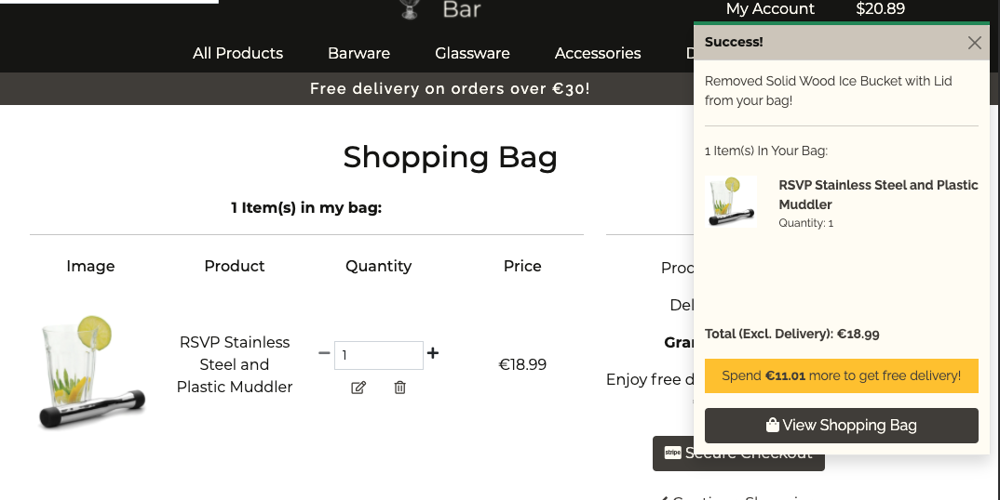
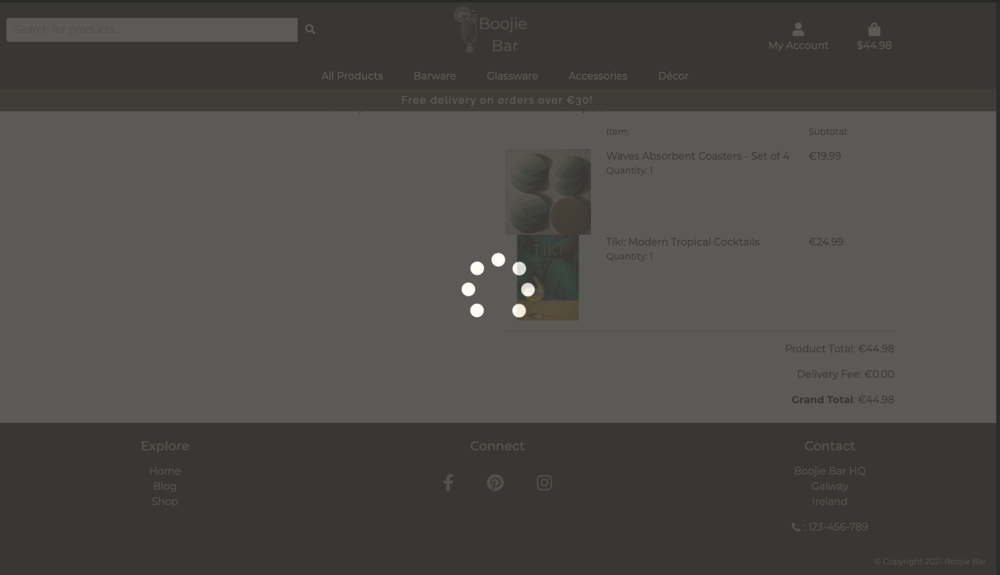
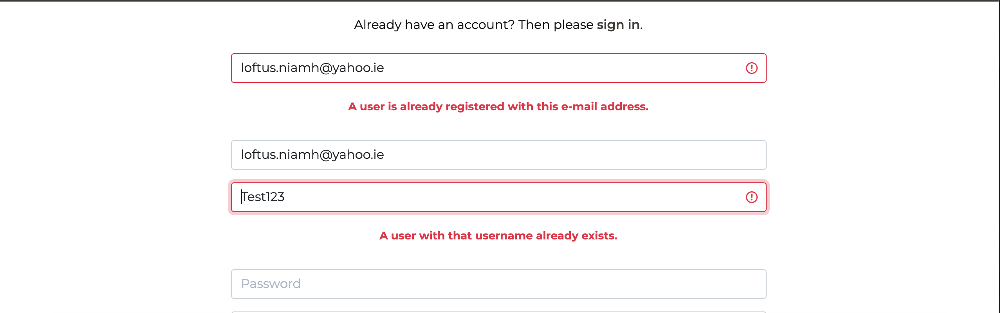

# 
**MS4: Boojie Bar**

 ### View the live project [here.](https://ms4-boojiebar.herokuapp.com/)
 ### View the main README file [here.](README.md)

---
## Contents
- [**Testing**](#testing)
    - [Code Validation](#code-validation)
    - [Links Testing](#links-testing)
    - [Navigation Testing](#navigation-testing)
    - [Device Testing](#device-testing)
    - [Browser Testing](#browser-testing)
    - [Bugs](#bugs)
    - [CRUD](#crud)
    - [Emails](#emails)
    - [Form Validation](#form-validation)
    - [Checkout and Stripe](#checkout-and-stripe)
    - [Testing User Stories](#testing-user-stories)
        - [All Users](#all-users)
        - [Registered Users](#registered-users)
        - [Admin Users](#admin-users)

---

## 
**Testing**

## **Code Validation**
- All CSS code was checked and validated with [W3C CSS Validation Service](https://jigsaw.w3.org/css-validator/). No errors reported.

- All HTML code was checked and validated with [W3C Markup Checker](https://validator.w3.org/nu/). No errors reported.

- All JavaScript code throughout the site passed through [JSHint](https://jshint.com/) with no major errors.

- Python code was passed through PEP8 online to ensure compliancy.
    - 4 lines in settings.py returned as "line too long".
        - I opted not to do anything about this as it's not affecting the code and I didn't want to do anything that would risk throwing huge errors.
    - All other .py files reported no errors.

---

## **Links Testing**
- I manually tested every link throughout the site and confirmed that none of them were broken.
- The three social media links in the footer correctly open into new tabs.
- All internal links work correctly and bring the user to the correct and expected location.
- When hovered over, all links have changes in font-weight and colour to emphasise that they are clickable links.

---

## **Navigation Testing**
- I performed manual testing on the site's navigation bar to ensure no issues would arise on both full and collapsed menus.
    - I did this manually on different devices and also made use of [Chrome DevTools](https://developers.google.com/web/tools/chrome-devtools).
- No issues or errors were noted and the menu collapses correctly on smaller devices.

---

## **Device Testing**
- I manually tested the site on several different devices ensuring that it was fully responsive and functional.
    - I also made use of [Chrome DevTools](https://developers.google.com/web/tools/chrome-devtools) again to view the site on a range of screen sizes.
- I tested my own devices and had a few friends check their own ones in order to get a wider range.
- The following were tested:
    - **Android Mobile**
        - Huawei P10, P30 Lite and P30
        - Samsung: Galaxy A5
        - OnePlus: 7t Pro
        - No errors or bugs reported on these devices.
    - **Android Tablet**
        - Samsung: Galaxy Tab 7
        - No errors or bugs reported on this device.
- This testing (along with DevTools) allowed me to note and fix some layout issues during development;
    - Initially some navbar elements were overlapping on very small screens.
    - The quantity selector on the shopping bag page was cramped with the icons appearing above and below it.
    - These issues were fixed with media queries.

---
## **Browser Testing**
- I manually tested the site on several different browsers ensuring that it remained functional.
- The following were tested on an Apple MacBook Pro:
    - **Google Chrome**: site works well with no issues noted.
    - **Safari**: bug noted. Details of which can be found [here](#bugs).
    - **Opera** site works well with no issues noted.
    - **Microsoft Edge** site works well with no issues noted.

---
## **Bugs**
- I encountered a bug with the **Safari** browser.
    - The site works perfectly with no issues up until the Checkout stage.
    - Once the forms are filled out and payment submitted, the loading screen appears as it should but then instead of bringing me to the Order Confirmation, it threw Error 500 and the logo is also missing.

    

    - I could not see anything in the console and researching the possible cause didn't reveal an answer.
    - **Safari** is the only browser that this happened in. 
    - Further testing will be required to fix this bug.
    - **This bug was not yet resolved upon submission of this project.**  

- There is a bug on the Shopping Bag page with the quantity selector.
    - If the user manually enters a number outside of the stated range (1-99) and clicks the update button, it allows the number to be accepted rather than alerting the user that they have entered an incorrect number. (e.g. it accepts -1 or 103)
    - The selector performs as normal on the product details page so the bug is just present here.
    - Further testing will be required to fix this bug.
    - **This bug was not yet resolved upon submission of this project.** 

- On the Add Blog and Add Comment forms, the corresponding Author and User fields are in the form of a dropdown menu containing the names of all registered site users rather than just the current signed-in user. This means that you can add a comment under another user's name which is not good.
    - Further troubleshooting is required to fix this bug.
    - **This bug was not yet resolved upon submission of this project.**

- Less of a bug and more of a styling/layout issue but on some pages of the site with not a lot of content the footer does not remain at the bottom. Initially having it sticky/fixed caused a lot of bigger layout issues so I removed those classes. It is something that will need to be worked out for a future release.

---

## **CRUD**
I manually tested CRUD operations on the site. Testing of Product CRUD is discussed in the Admin User section of [Testing User Stories](#testing-user-stories).

- I manually tested this by logging in as admin and navigating to the Manage Blogs page by clicking the My Account dropdown menu in the navigation bar and selecting Manage Blogs.

- The Manage Blogs link took me to the Add Blog page.
- I saw a form with fields for Author, Title, Body text, Image url and Select Image (file selector) with a Cancel button and an Add Blog button.

- I attempted to submit the form, leaving the required field empty and was alerted to the error.
- I fully filled the form out and clicked the Add Blog button.
- I was brought directly to the new blog post's page.
- A toast message appeared confirming the successful addion of the blog.

- I navigated to the All Blogs page via the link at the top of the blog details page.
- I could see the new blog post there also; successfully added to the site.

- As admin I could see an Edit button/icon above the Blog image on the blog details page.
- I clicked the Edit button and was brought to the Edit Blog page.
- I saw a form with fields for Author, Title, Body text, Image URL and Select Image (file selector), pre-filled with the product's current values, with a Cancel button and an Update Blog button.
- A toast message appeared confirming that I was editing that particular blog.

- I attempted to submit the form, leaving the required field empty and was alerted to the error.
- I made a couple of edits to the form fields and clicked the Update Blog button.
- I was brought directly to the new blog post's page.
- A toast message appeared confirming the successful update to the blog.
- This newly edited blog post can be seen on the site; successfully updated.

- As admin I could see a Delete button/icon above the Blog image on the blog details page.
- I clicked the Delete button which immediately deleted the blog from the site.
- I was redirected back to the Blogs page.
- A toast message appeared confirming the deletion of the blog.
- The deleted blog post cannot be seen on the site; successfully deleted.

    

From my testing, CRUD operations are functional and in-place where necessary.

---

## **Emails**
I manually performed various tasks on the site to ensure that Emails were successfully sent when supposed to. I received an email to verify my email address upon registering for an account, for resetting my password and for my order confirmations. More details can be found in [Testing User Stories](#testing-user-stories).

---
## **Form Validation**
I manually filled out and checked all forms on the site to ensure they functioned as expected. Forms checked include Sign Up, Sign In, Reset Password, Change Password, Checkout, Update Profile, Add Product, Edit Product, Add Blog, Edit Blog, Add Comment.
- All forms from my testing worked as expected, alerted me to fields left blank, alerted me to fields filled out incorrectly.
- The only bug noted is in the Add Blog and Add Comment forms, which I have detailed [here](#bugs).
- More details can be found in [Testing User Stories](#testing-user-stories).

---

## **Checkout and Stripe**
I tested the Stripe payment method on the Checkout page to ensure it was functioning.
- I tried to submit the form leaving the whole field blank and was alerted to the error.
- I tried to submit with an invalid card number and was alerted to the error.
- I tried to submit with a past expiry date and was alerted to the error.
- I tested using Stripe's test card: 4242 4242 4242 4242 02/24 24242 and was able to submit successfully. 

From this testing I concluded that it is functioning as expected with the exception of [this bug](#bug) found on **Safari**. More details can be found in [Testing User Stories](#testing-user-stories).

---

## **Testing User Stories**
### **All Users**
- **"As a customer; I want the site to be responsive and easy to navigate."**
    - The user will find the site to be responsive across devices as seen below.
    - All content can be seen clearly across devices.
    - The site is visully consistent throughout.

    

    - The user can always find the navigation bar on the top of the page regardless of what page they are currently on.
    - The user can always click on the logo in the navigation bar to bring them back to the *Home* page.
    - The user can see clear names of each page so they know what to expect and where to go for what they're looking for:

    

    - The user can see clear names of each page even on smaller devices with a collapsed menu:

    

- **"As a customer; I want to view all products available on the site."**
    - The user can click on the Shop Now button on the *Home* page to access All Products on the site.
    - The user can see the total number of products on the page.
    - The user can scroll down this page, seeing all the products, each product in its own panel.

     

    - On each panel the user will see each products's image, name, price, category and rating.
    - The image and name of each product acts as a link and, when clicked, will bring the user to that product's own page.

     - The user can also click on the All Products link in the navigation bar to access All Products on the site.

- **"As a customer; I want to view individual details of each product."**
    - The user can click on the product image or name on the main products page to be directed to the Product Details page"

    - The user will find details about that particular product, seeing its name, image, price, category, rating and description.

    - The user can see this for every product on the site.
    
    

- **"As a customer; I want to view all products in a specific category."**
- The user can click on the category links in the navigation bar to view products by their category. 
    - Clicking *Barware* reveals links for Shakers, Tools, Bar Sets and All Barware.
    - Clicking *Glassware* reveals links for Cocktails, Novelty, Serving and All Glassware.
    - Clicking *Accessories* reveals links for Extras, Books, All Accessories.
    - Clicking *Décor* reveals links for Lighting, Decorations, All Décor.
    - Clicking on any of the above category links will bring the user directly to a page of products from that chosen category.
- If the user clicks All Glassware, for example, they'll be brought to that category page.
    - This page then contains links to the individual categories, Cocktails, Novelty and Serving.

    

    - These are clickable links which, if clicked, will bring the user to those more specific category pages.

    

- **"As a customer; I want to easily add my chosen products to my shopping bag."**
    - The user can navigate to their chosen product's detail page.
    - The user can see a quantity selector box beneath the product description.
        - The user can enter a number between 1 and 99, the number being the quantity of that product they wish to add to their shopping bag.
        - If they enter a number less than 1 they will see an error.

        

        - If they enter a number greater than 99 they will see an error.

        

        - The user can also click the plus and minus icons on either side of the quantity selector to adjust the quantity accordingly.
    
    - The user can see an Add to Bag button below the quantity selector.

    - The user can click this button to add the product (quantity dependent on the number entered in the selector) to their shopping bag.

    

    - The user can see a toast message appear on the top right of the screen confirming the product has been successfully added to their shopping bag.

    

- **"As a customer; I want to easily view the total of my shopping bag."**
    - The user can view the total of their shopping bag at any time, on any page of the site by looking at the shopping bag icon in the navigation bar.
        - This icon will always display the current total of the user's shopping bag, even if the total is €0.00.
        - The user can click on this icon to be brought directly to the Shopping Bag page where they can also view the total.
    - The user can also view the total of their shopping bag within the toast message that appears whenever the user adds a product to their bag.
        - The user can click on the View Shopping Bag button at the bottom of the toast message to be brought directly to the Shopping Bag page where they can view the total. 

    

- **"As a customer; I want to adjust the quantity of each product in my shopping bag or delete it entirely."**
    - The user can navigate to their shopping bag using the link in the navigation bar or the View Shopping Bag button within the toast message.
    - The user can see a quantity selector for each product in their bag beneath the Quantity heading.
        - The user can enter a number between 1 and 99, the number being the quantity of that product they wish to add to their shopping bag.
        - The user can also click the plus and minus icons on either side of the quantity selector to adjust the quantity accordingly.
        - The user can click the edit button/icon below the selector once they have entered their desired quantity.
        - This button will successfully adjust the quantity of the chosen product.

        

    - The user can click the delete button/icon below the selector to completely remove the product from their shopping bag.

    

- **"As a customer; I want to sort products by price, name, ratings etc."**
    - The user can click on the All Products dropdown menu link in the navigation bar.
        - This dropdown link will reveal links for sorting products By Price, By Rating and By Name.
        - Clicking any of the links will bring the user to the Products page where the products are sorted by the chosen link.

        

    - The user can navigate to the Products page.
    - The user will see a Sort Selector box below the Products heading.
        - The user can click this selector to reveal the different ways in which the products can be sorted.

        

        - Price (low to high)

        

        - Price (high to low)

        

        - Rating (low to high)

        

        - Rating (high to low)

        

        - Name (A-Z)

        

        - Name (Z-A)

        

- **"As a customer; I want to search for a specific product."**
    - The user can see a search bar in the navigation bar on all pages of the site.
        - This search bar is within the collapsed menu on smaller devices.
    - The user can type in their search query into the box and hit enter or click the search icon beside the box to submit the search query.
    - If the search query has found results, the user will see these results displayed on the Products page.
        - Beside the All Products link, the user will see a message displaying the number of products that matched their entered search query as well as displaying the actual search query.

    

    - If the search query did not produce any results, the user will not see any products listed on the page.
        - Beside the All Products link, the user will see a message showing that no products were found for the entered search query.
        - The All Products link can reveal all the products again or the user can enter another search into the searchbar.

    

- **"As a customer; I want to easily complete my purchase in the checkout."**
    - The user can navigate to their shopping bag using the link in the navigation bar or the View Shopping Bag button within the toast message.
    - The user can see the items they currently have in their bag as well as the price, delivery fee and grand total.
    - The user can see a Secure Checkout button beneath the summary.
    - The Secure Checkout button, when clicked, will bring the user directly to the Checkout page.

    

    - Arriving on the checkout page, the user can see a form to be filled out with their details
        - Details: Full Name*, Email Address*
        - Delivery: Phone Number*, Street Address 1*, Street Address 2, Town or City*, County, Country* (dropdown menu) Postal Code. 

    

    - The user will see a message below the form informing them that their details can be saved for again if they create an account or sign in.
    - The user can fill this form out with their details.
        - The user will be alerted if any required field is left blank and will not be able to proceed until the problem is resolved.

    

    - The user will see a Payment method field to enter their card details; card number, month/year expiry, CVV/CVC number and ZIP.
        - The user will see a message beneath the payment field displaying how much their card will be charged for to avoid any confusion for the user.
        - Upon entering their card details, the user will be alerted if they enter an invalid card number.

        

        - The user will be alerted if they enter an invalid expiry.

        

    - The user will see a Complete Order button which, when clicked will cause a loading overlay to appear for a second while the payment is processed and the order submitted.

    

    - The user will be brought to the order confirmation page which displays the user's email, the order confirmation number, order time and date, list of products ordered, delivery address and total cost.

    

- The user has completed their purchase.

- **"As a customer, I want visual confirmation of any task performed."**
    - The user will see toast messages appearing in the top right of the screen, just below the shopping bag icon whenever a task is performed.
    - Examples of such toast messages can be seen in the user stories above.
    - Tasks which product a toast confirmation include adding a product to your basket, adjusting the quantity of a product in your basket, deleting a product from your basket, successfully submitting an order.
        - For registered users this also includes signing in, signing out, editing your profile, adding a blog comment.
        - For admin users this also includes adding a product to the site, updating a product, deleting a product, adding a blog post to the site, updating a blog, deleting a blog.

- **"As a customer, I want to receive confirmation of my order."**
    - The user will receive an email with their order confirmation to the email address they provided in the Checkout form.
    - This email will contain the order number, the date and time the order was created at, the order total and shipping details.

    

- **"As a customer; I want to easily register for an account."**
    - The user can navigate to the Sign Up page by clicking the My Account dropdown menu in the navigation bar and selecting Sign Up.
    - The user will see a form to be filled out with fields for Email, Email Confirmation, Username, Password, Password Confirmation and a Sign Up button.
        - All fields are required and the user will not be allowed to submit the form if it is filled out incorrectly. 
        - The user will be alerted if any field is left blank.
        - The user will be alerted if their email address is already registered to a user.
        - The user will be alerted if their chosen username has already been taken.

    

    - The user can click the Sign Up button and (if the form is valid) will be brought to a Verify Your Email page.
    - The user will see a message confirming that an email has been sent to their email address.
    - The user will see a toast message appear displaying their email address.

    

    - The user can go to their email address and find a Please Confirm Your Email Address email with a link that the user needs to click to confirm the email.

    

    - The user can click on that link and they will be brought to the Confirm Email page.
    - The user will see that they're being asked to confirm the displayed email is correct.
    - The user will see a Confirm button which, when clicked, will confirm the email and bring the user to the Sign In page.

    

 

    - The user will see the Sign In form with fields for Username/e-mail and password.
    - The user will see a toast message confirming the email verification was successful.

    

    - The user can enter their email/username and password and click Sign In to sign into their new account.
        - The user will be alerted if either field is incorrect or left blank.

    

    - If the user has entered the correct information, clicking the Sign In button will sign them in successfully and redirect them to the Home Page of the site.
    - A toast message will appear confirming a successful login for that user.
    - The user has successfully registered an account.

    

### **Registered Users**
- **As a registered customer; I want to easily log in and out of my account.**
    - The user can navigate to the Sign In page by clicking the My Account dropdown menu in the navigation bar and selecting Sign In.
    - The user will see the Sign In form with fields for Username/e-mail and password.
        - The user will be alerted if either field is incorrect or left blank.
    - The user can enter their details, click Sign In and, provided their details are correct, will be successfully signed into their account.
    - To sign out, the user can navigate to the Sign Out page by clicking the My Account dropdown menu in the navigation bar and selecting Sign Out.
        - The user will see a message asking if they wish to sign out and a Sign Out button.
        
        

        - The user can click the Sign Out button and will be redirected to the Home page.
        - A toast message will appear confirming the user has signed out.

        

- **"As a registered customer; I want to easily recover access to my account if I forget my password."**
    - The user can see a link for Forgot Password? beneath the Sign In button on the Sign In page.
    - The user can click this button and will be brought to a Password Reset page with a single form field for email address and a Reset My Password button.
    
    

    - The user can click the Reset My Password button which will trigger an email to be sent to their entered email address.
    - The user can go to their email address and will find the Password Reset Email which contains a link that the user will need to click.

    

    - The user can click this link which will bring them to a Change Password page.
    - The user will see a form with two fields for New Password and New Password (again) and a Change Password button.
    - The user can enter their new password and click the Change Password.

    

    - A toast message confirms that the password has been changed.
    - The user has successfully changed their password and can now sign back into their account using it.

    

- **As a registered customer; I want my checkout details saved after making a purchase."**
    - The user can navigate to the Checkout page.
    - The user can fill out the Checkout form with their details.
    - The user can see a message, "Save this delivery information to my profile" with a checkbox beneath the form.
    - The user can tick this checkbox to save the form details to their profile.

    

     - The user can complete their purchase and navigate to their profile via the My Account link in the navigation bar.
     - The user can see their Default Delivery Information form is pre-filled with the information that they entered in the checkout form.
     - The user successfully saved their checkout details after making a purchase.
     - The user will find that information pre-filled on the Checkout form the next time they go to make a purchase.

    

- **"As a registered customer; I want to view my profile."**
    - The user can navigate to their profile via the My Account link in the navigation bar.
    - The user can see their profile with their username displayed below the My Profile heading.
    - The user can see their Default Delivery Information form.
        - This could be empty if they have not saved their details yet.
        - Or it could be filled with saved details from their checkout form.
   
- **"As a registered customer; I want to view my previous orders."**
    - The user can navigate to their profile via the My Account link in the navigation bar.
        - The user can see their order history, if they have any.
        - The user can scroll down through this list (scrolling feature to save space).
        - This order history contains a list which each order displaying its own  order number, order date, products bought and total.
        - The order number acts as a link and when clicked will bring the user to the orginal order confirmation page with a toast message alerting the user that it is a past confirmation order to avoid confusion

    

- **"As a registered customer; I want to edit my details on my profile."**
    - The user can navigate to their profile via the My Account link in the navigation bar.
    - The user can see an Update button below the Default Delivery Information button.
    - The user can fill out the form with their new details and then click Update.
    - The form will be updated with the newly entered details.
    - A toast message appears confirming the successful update.

    

- **"As a registered customer; I want to post comments on blog posts.**"
    - The user can navigate to the Blog page via the Blog link located in the footer.

    

    - The user can scroll down this page, seeing all the blogs, each post in its own panel.

     

    - On each panel the user will see each blog post's image, title, author, date created, a snippet of the blog content and a Read More button.
    - The image, tile and Read More button in each panel acts as a link and, when clicked, will bring the user to that blog's own page.
    - Scrolling down to the bottom of each blog's page, the user will find a comment section.
    - The user will see the total number of comments for the post followed by each comment in its own small section.
        - Each comment displays the comment author, the date and time it was added and then the comment itself.
    - The user will see an Add Comment form below the comments with fields for User and Body (i.e. Comment content).
        - The user can see a Cancel button which when clicked will redirect the user to the top of that blog's page.  

    

    - The user can see an Add Comment button which when clicked will successfully post the comment to the blog (assuming the form is filled out correctly)
        - The user will be alerted if they attempt to submit the form with any field errors.
    - A toast message will appear confirming the successful comment addition to the blog.
    - The user can see their new comment in the comment section.

    

**Admin Users**
- **"As an admin; I want to be the only one who is able to add, edit and delete products."**
    - If a non-admin user tries to access the pages for Add Product, they will be immediately redirected to the Home page with a toast message displaying an error.

    

    - If a non-admin user attempts to access pages for Editing or Deleting Products, they will be immediately redirected to the Home page with a toast message displaying the error.

    

    - The admin can navigate to the Manage Products page by clicking the My Account dropdown menu in the navigation bar and selecting Manage Products.

    

    
    - The Manage Products link will take the admin to the Add Product page.
    - The admin will see a form with fields for Category (dropdown-menu), Name, Description, Price, Rating, Image URL, Select Image (file selector) and an Add Product button.
    - The admin will be alerted if they try to submit the form with any of the required fields (with *) empty or filled out incorrectly.

    

    - The admin can fill out this form and click the Add Product button to successfully add the new product to the site.
    - The admin will be brought directly to the new product's own page.
    - A toast message will appear confirming the successful addion of the product to the site.
    - This new product can now be seen and searched for on the site.
    
    

    - The admin can fill out this form without an image and still successfully add the new product to the site.
        - The image will be replaced with a default.
    - The admin will be brought directly to the new product's own page.
    - A toast message will appear confirming the successful addion of the product to the site.
    - This new product can now be seen and searched for on the site.

    

    
    - The admin can see an Edit button/icon beneath the Product rating on the Products page and the individual product details page.
        - This icon is only visible to admin users.
    - The admin can click this button to be brought to the Edit Product page.

    

    - The admin will see a form pre-filled with the selected product's Category (dropdown-menu), Name, Description, Price, Rating, Image URL, Select Image (file selector).
    - A toast message appears confirming that you are currently editing that product.
    - The admin will be alerted if they try to submit the form with any of the required fields (with *) empty or filled out incorrectly.
    - The admin can see a Cancel button which, when clicked, will redirect them to that product's page.

    

    - The admin can fill out this form and click the Update button to successfully update the  product on the site.
    - The admin will be brought directly to the newly updated product's page.
    - A toast message will appear confirming the successful update of the product.
    - This newly edited product can be seen and searched for on the site.

    

    
    - The admin can see a Delete button/icon beneath the Product rating on the Products page and the individual product details page.
        - This icon is only visible to admin users.
        - The admin can click this button which immediately deletes the product from the site; it cannot be undone.
    - The admin is redirected back to the Products page.
    - A toast message appears confirming the deletion of the product.
    - The deleted product cannot be seen or searched for on the site.

        

