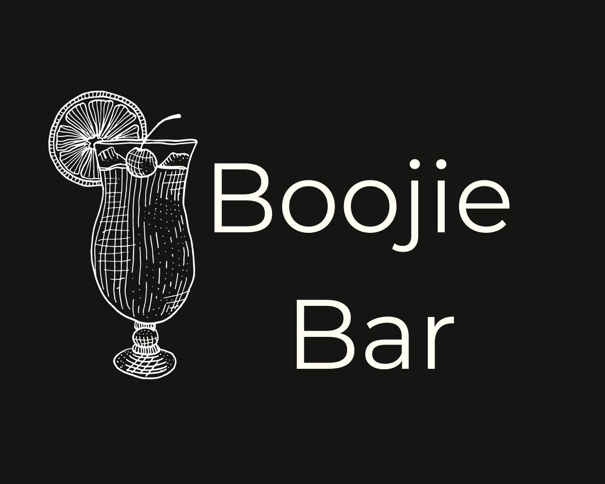

# 
**MS4: Boojie Bar**

 ### View the live project [here.](https://ms4-boojiebar.herokuapp.com/)
 ### View the main README file [here.](README.md)

---
## Contents
- [**Testing**](#testing)
    - [Code Validation](#code-validation)
    - [Links Testing](#links-testing)

---
## 
**Testing**
